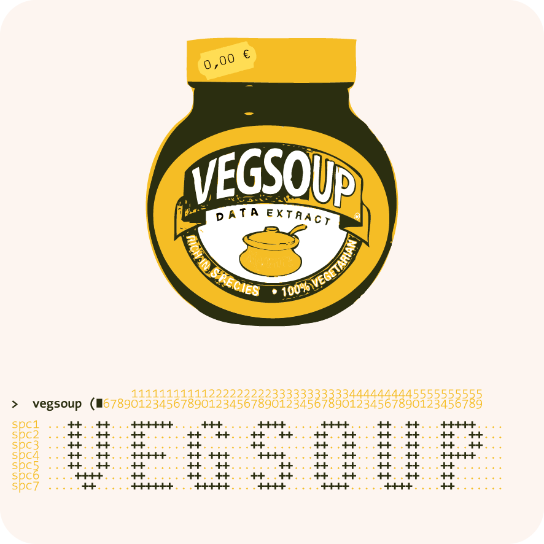

vegsoup-data
============

Collection of vegetation data.
------------------------------

This is our personal vegetation data base (spatial and temporal explicit species occurrence data). It contains of a bunch of unpublished data sets (1469 releveés), as well as data taken from the literature (1890 releveés). The bibtex file `./refernces.bib` that is contained in each project folder gives citation information for a particular data set (see also section licence).

Data sets containing a file named `transcript.txt` are ready to be used with the **vegsoup** *R*-package, available [here](http://r-forge.r-project.org/projects/vegsoup/). Just download the corresponding `*.rda` file and load it into your *R* session. Most data sets link to a standard list, available [here](https://github.com/kardinal-eros/vegsoup-standards/tree/master/austrian%20standard%20list%202008).

Licence
-------

 This work is licensed under a Craetive Commons licence <a rel="license" href="http://creativecommons.org/licenses/by-nc-sa/4.0/">Attribution - NonCommercial - ShareAlike 4.0 International</a>.

<!-- Please contact me (kardinal.eros at gmail.com) if you want to use any of the data sets in a publication.

Short note about formats
------------------------
Date format is in general IS0 8601.
Coordinates are given in decimal degree with 6 significant digits and refer to the WGS84 ellipsoid (EPSG code 4326). A field named `accuracy` is available for most data sets and quantifies coordinate uncertainty in meters.
-->
